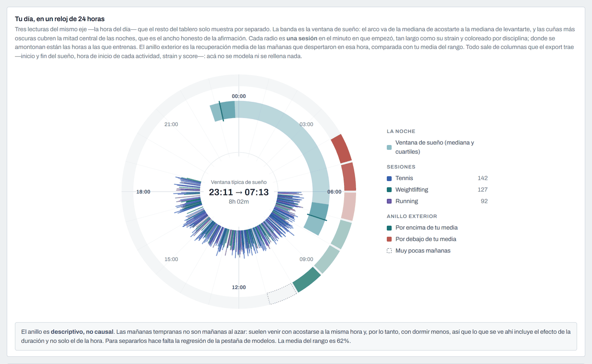
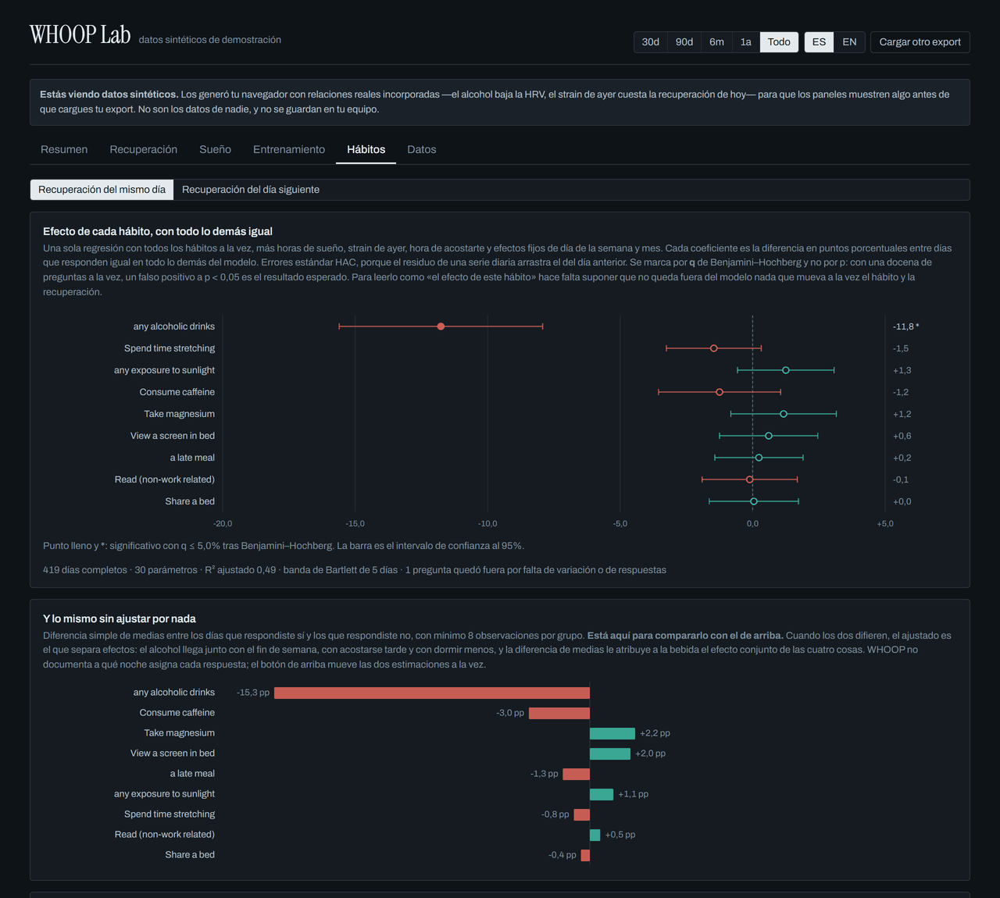
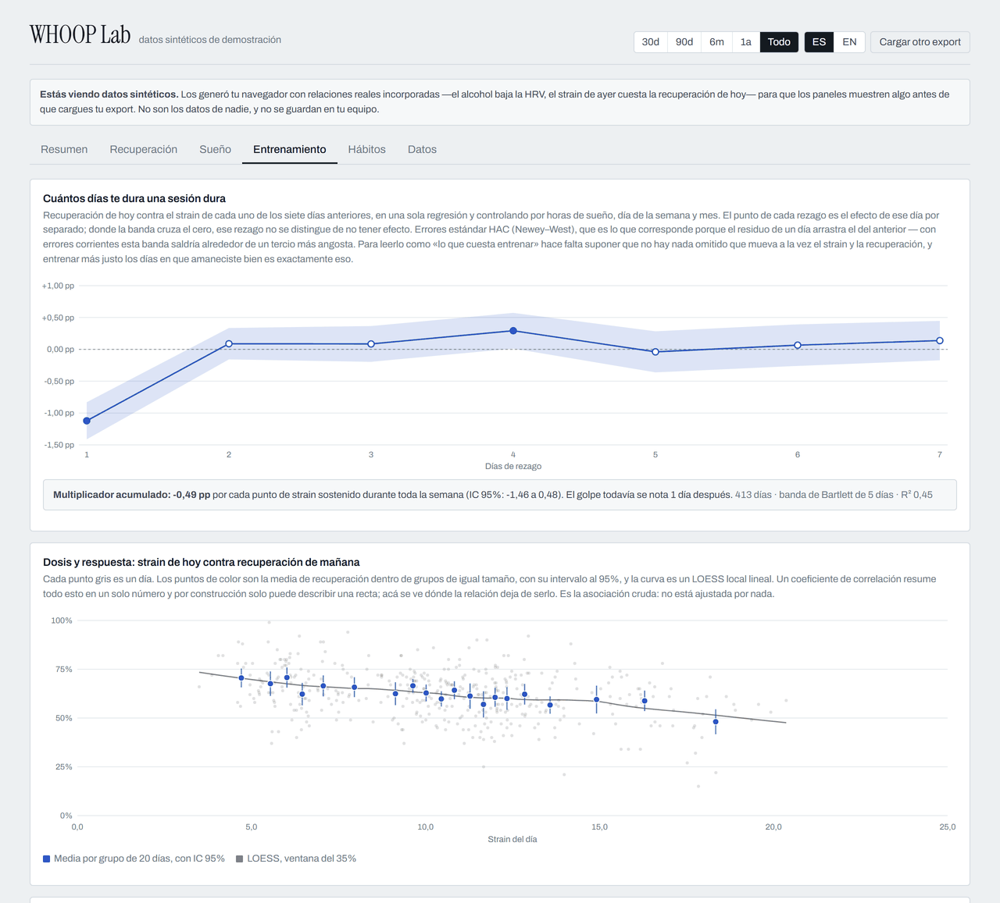
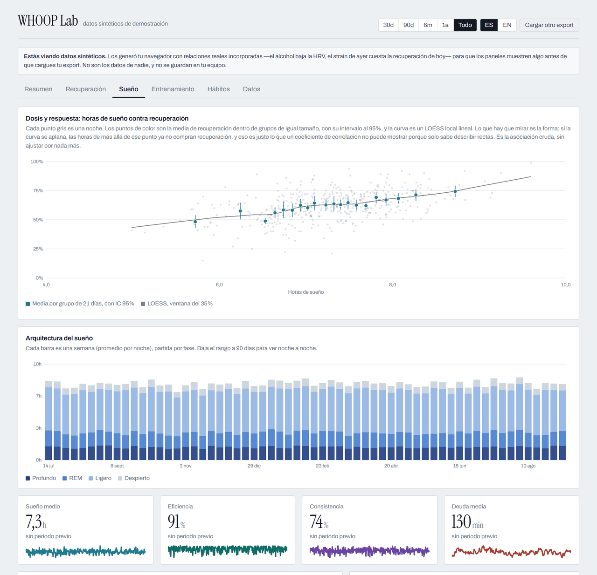
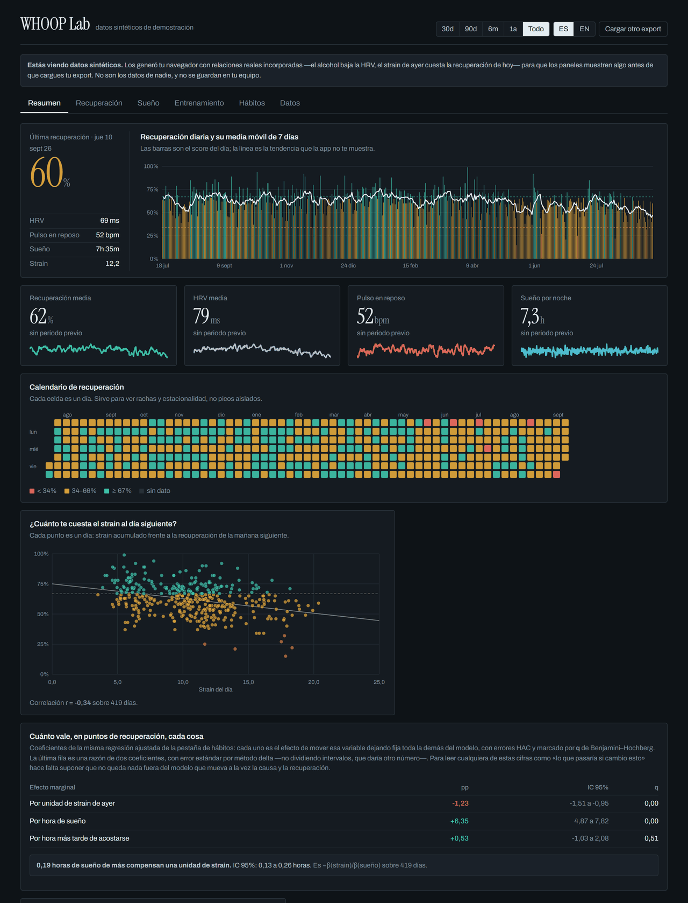
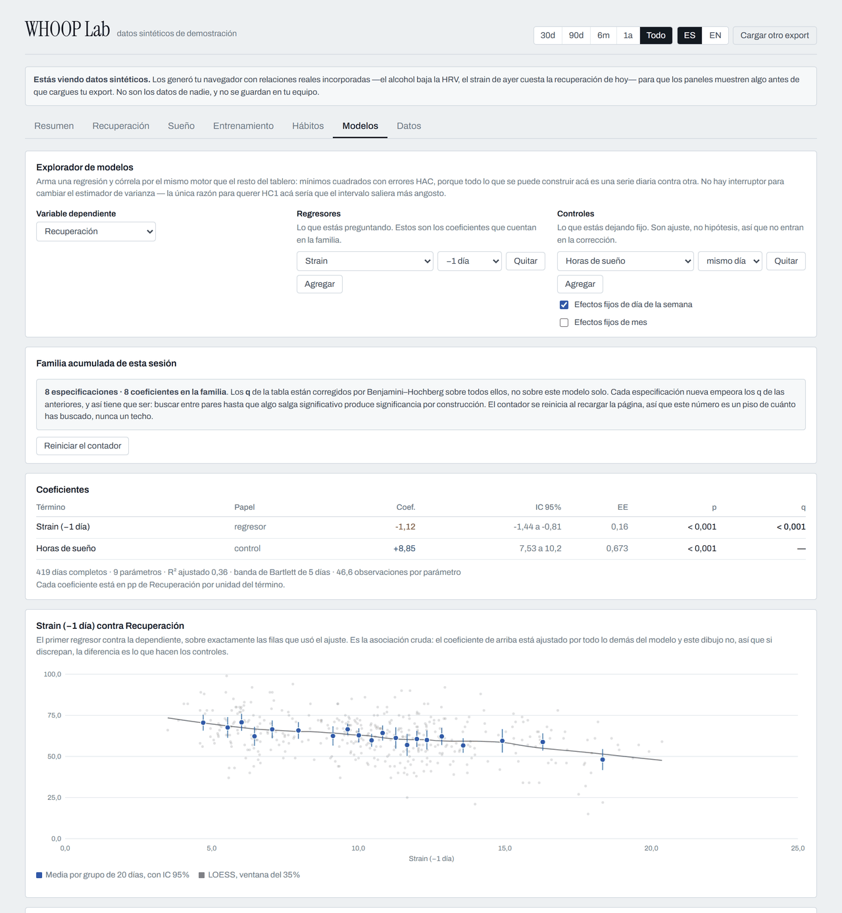
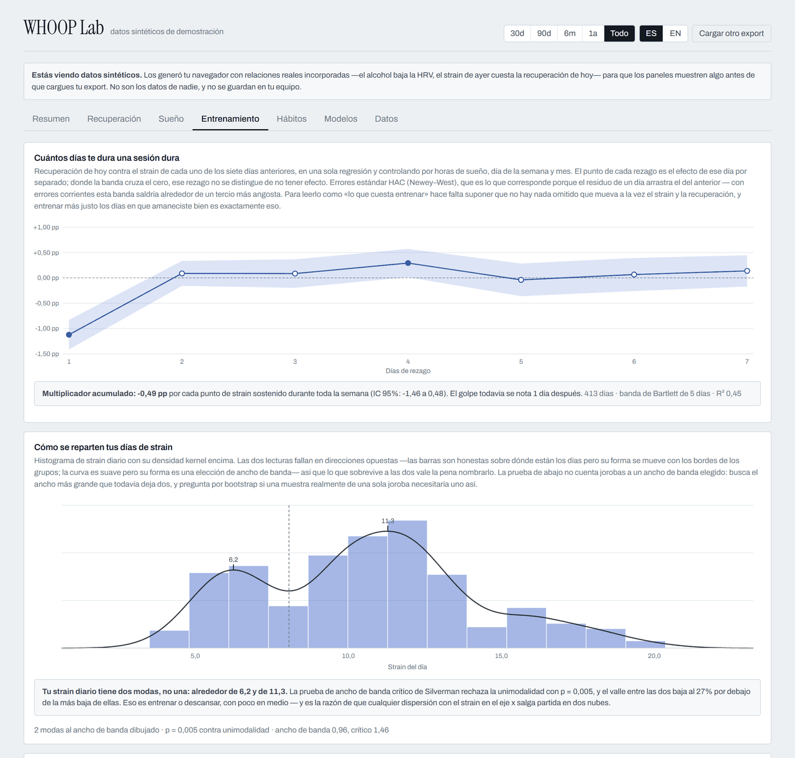
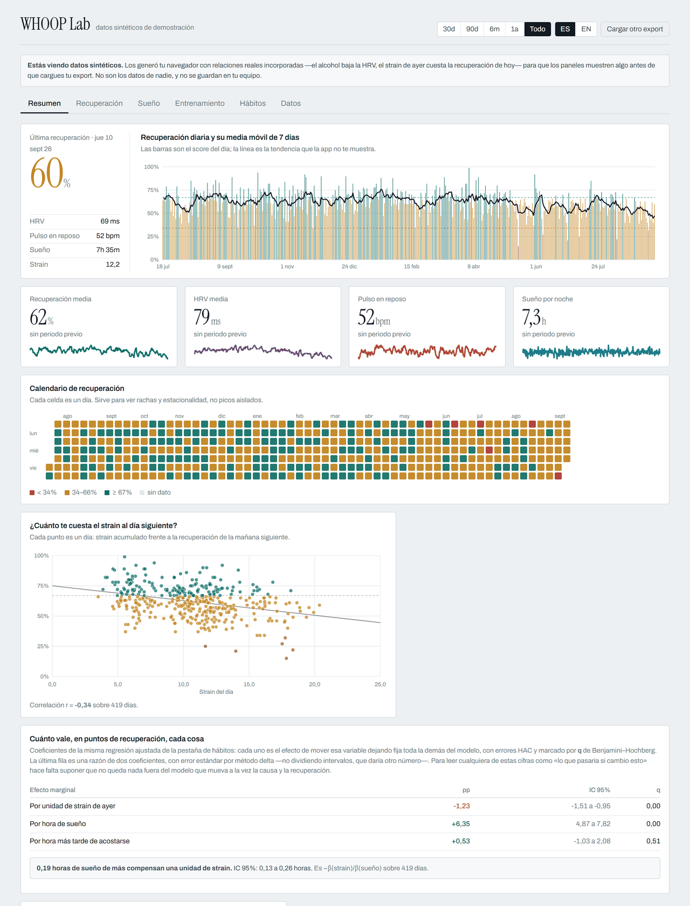
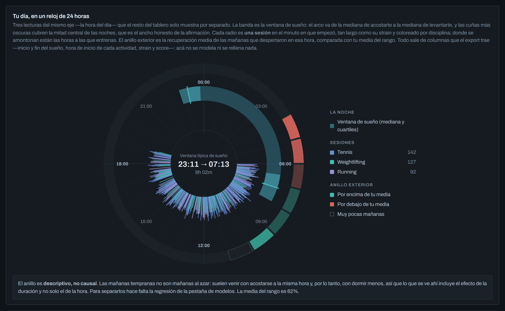
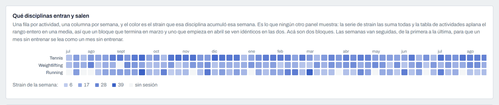

<div align="center">

# WHOOP Lab

**Tu export de WHOOP, analizado en serio. En tu navegador. Nada se sube a ningún lado.**

**[Abrir la demo →](https://USER.github.io/whoop-lab/?demo=1)** · [Read this in English](README.md)



</div>

## Por qué

WHOOP te da un número cada mañana y esconde la serie detrás de sus propias
vistas. El export, en cambio, trae todo: recuperación, HRV, pulso en reposo,
strain, arquitectura completa del sueño y cada respuesta del diario que hayas
dado.

Hay varias herramientas que te vuelven a dibujar ese export. Esto es lo que
ninguna hace:

- **El efecto de los hábitos sale de una regresión, no de una diferencia de
  medias.** Todas las preguntas del diario entran en un solo modelo a la vez,
  junto con horas de sueño, strain de ayer, hora de acostarte y efectos fijos de
  día de la semana y mes. La diferencia importa: el alcohol llega junto con el fin
  de semana, con acostarse tarde y con dormir menos, y una diferencia de medias le
  atribuye a la bebida el efecto conjunto de las cuatro cosas. Las dos
  estimaciones se muestran una al lado de la otra para que veas la brecha.
- **Función de respuesta al impulso del strain.** La recuperación de hoy contra el
  strain de cada uno de los siete días anteriores, en una sola regresión de
  rezagos distribuidos, con el multiplicador acumulado y su banda de confianza.
  Contesta «cuántos días me dura una sesión dura» en vez de «¿el strain
  correlaciona con la recuperación?».
- **Errores estándar HAC (Newey–West) donde corresponde.** El residuo de un día
  arrastra el del anterior, y los errores corrientes sobre una serie diaria salen
  alrededor de un tercio más angostos de lo que deberían — es decir, un tercio más
  convincentes.
- **Control de multiplicidad.** Con una docena de preguntas puestas a prueba a la
  vez, un falso positivo a p < 0,05 es el resultado esperado, así que los
  coeficientes se marcan por **q** de Benjamini–Hochberg y nunca por p crudo.
- **Lee exports localizados sin tocar nada.** Una cuenta en español recibe
  `sueño.csv` y `entrenamientos.csv` con todos los encabezados traducidos. El
  parser compara subcadenas del encabezado sin acentos en vez de nombres exactos,
  así que entran las dos variantes sin renombrar archivos.
- **El día entero en una esfera de 24 horas.** La ventana de sueño como arco, con
  el rango intercuartil de los dos extremos; cada entreno como un radio en el
  minuto en que empezó, tan largo como su strain y coloreado por disciplina; y un
  anillo exterior con la recuperación según la hora de despertar. Tres lecturas que
  el resto del tablero solo muestra por separado, y ninguna contesta dónde cae la
  carga del día hasta que comparten eje. Cada marca es una fila del export: sin
  modelo, sin suavizado y sin rellenar nada.
- **Un explorador de modelos que lleva la cuenta de cuánto buscaste.** Arma
  cualquier regresión con los campos del registro diario —dependiente, regresores,
  controles, un rezago por término— y córrela por el mismo motor HAC que todo lo
  demás. Lo que no hace ninguna otra herramienta: mantiene la familia acumulada de
  cada regresor probado en la sesión y corrige con Benjamini–Hochberg sobre todos,
  así que el q de tu tercer modelo empeora cuando corres el vigésimo. Sin eso, un
  explorador libre es una máquina de p-hacking: prueba suficientes pares y algo
  sale significativo por construcción.
- **Te dice cuándo el eje x tiene un hueco.** El strain diario suele ser bimodal
  —días de descanso en una joroba, días de entreno en otra— y una prueba de ancho
  de banda crítico de Silverman lo afirma, en vez de dejarte contar jorobas al
  ancho de banda que elijas. Donde el soporte de x de una gráfica tiene una banda
  vacía, el panel avisa que la pendiente que la cruza une dos grupos y no describe
  una relación.
- **Interfaz en español e inglés**, detectada desde tu navegador y conmutable en
  el encabezado. El formato de números sigue al idioma, para que una coma decimal
  nunca aparezca en una página en inglés.

Además de las líneas base móviles, los z-scores, la razón de carga aguda sobre
crónica, una curva de dosis y respuesta con ajuste LOESS, un periodograma de
Lomb–Scargle que tolera los huecos de tu export y una tabla diaria consolidada
para pegar directo en Excel, R o Stata.

Todo lo de abajo son datos sintéticos de la demo: 420 días generados en tu
navegador con relaciones reales incorporadas.

|                                                                          |                                                                   |
| ------------------------------------------------------------------------ | ----------------------------------------------------------------- |
|  |       |
| **Hábitos.** Las mismas preguntas estimadas de dos maneras.              | **Entrenamiento.** Cuánto dura de verdad una sesión dura.         |
|                     |          |
| **Sueño.** Dónde las horas de más dejan de comprar recuperación.         | **Modo oscuro**, siguiendo al sistema o a tu elección.            |
|                          |  |
| **Modelos.** La regresión que quieras, con la búsqueda contada.          | **Distribución.** Dos modas, nombradas y puestas a prueba.        |
|                          |            |
| **Resumen.** Líneas base, tarjetas y las elasticidades ajustadas.        | **La esfera en modo oscuro.**                                     |



## Privacidad

Todo corre en el cliente. Los CSV se parsean en el navegador, se guardan en
IndexedDB de tu propia máquina y no viajan a ningún servidor. No hay backend, no
hay analítica y no hay una sola petición de red después de cargar la página. Lo
puedes verificar leyendo `src/lib/whoop/` en unos diez minutos.

La demo de `?demo=1` genera sus datos en el momento y a propósito no escribe nada
en IndexedDB, así que seguir ese enlace nunca toca un export que ya tuvieras
guardado.

El `.gitignore` además bloquea `*.csv` y toda la carpeta `data/`, para que no
subas tus datos de salud por accidente mientras trabajas en el repo.

## Cómo sacar tus datos

En la app de WHOOP: **More → App Settings → Data Export** (en Android, **More →
Data Export**). Te llega un correo con un ZIP con cuatro archivos:

| Archivo                    | Qué trae                                                                       |
| -------------------------- | ------------------------------------------------------------------------------ |
| `physiological_cycles.csv` | Una fila por ciclo: recuperación, HRV, RHR, strain, calorías, resumen de sueño |
| `sleeps.csv`               | Cada sueño y siesta, con fases                                                 |
| `workouts.csv`             | Actividades clásicas. **No incluye sesiones de Strength Trainer**              |
| `journal_entries.csv`      | Todas tus respuestas del diario                                                |

El export sale en el idioma de tu cuenta: si la tienes en español te llegan
`sueño.csv` y `entrenamientos.csv`, con todos los encabezados traducidos. El
parser lee las dos variantes, porque compara subcadenas del encabezado sin
acentos en vez de nombres exactos.

Límites que conviene tener presentes: un export cada 24 horas, y a inicios de
2026 el export no trae actividades de recuperación, stress diario, pasos ni
VO2 Max. En [docs/formato-export-whoop.md](docs/formato-export-whoop.md) está la
referencia completa de columnas y las decisiones de parseo que se derivan de
ella.

## Cómo correrlo

```bash
git clone https://github.com/USER/whoop-lab.git
cd whoop-lab
npm install
npm run dev
```

Suelta tu ZIP en la página, o ábrela con `?demo=1` —o dale a **mira una demo con
datos sintéticos**— para explorar con datos generados que tienen relaciones reales
incorporadas.

```bash
npm run build      # typecheck + bundle de producción
npm test           # pruebas del parser y de la estadística
npm run lint
npm run format
npm run fixture    # regenera el fixture anonimizado a partir de data/
```

### Trabajar con tu propio export

Descomprime tu export en [`data/`](data/README.md) y `npm run dev` arranca
directamente con él, sin pasar por la pantalla de importación. El encabezado dice
**«datos locales de data/»** para que siempre sepas de dónde salen los números.
La carpeta está en el `.gitignore`, y dos guardas independientes la mantienen
fuera de `npm run build`: el lector solo se importa detrás de
`import.meta.env.DEV`, y un plugin de Vite vacía el módulo durante el build. El
flujo y el comando para verificarlo están en
[docs/arquitectura.md](docs/arquitectura.md#desarrollo-con-datos-reales).

`npm run fixture` convierte esa carpeta en los CSV anonimizados de
`src/test/fixtures/`: fechas desplazadas a un año ficticio, ruido en cada valor
fisiológico y preguntas del diario recortadas a una lista neutra. Esos **sí** se
versionan, y `src/test/fixture.test.ts` corre el pipeline completo sobre ellos.

## Decisiones técnicas

| Decisión                                           | Razón                                                                                                                                                                                     |
| -------------------------------------------------- | ----------------------------------------------------------------------------------------------------------------------------------------------------------------------------------------- |
| React 19 + TypeScript estricto + Vite              | Aburrido, rápido, y el sistema de tipos hace trabajo real en `src/lib/whoop/types.ts`                                                                                                     |
| Econometría escrita a mano en `src/lib/econ/`      | Mínimos cuadrados por QR, covarianza HAC y HC1, rezagos distribuidos, LOESS, Lomb–Scargle, prueba de modalidad de Silverman. Ninguna dependencia hace esto en un tamaño que valga la pena |
| Gráficas SVG propias sobre `d3-scale` / `d3-shape` | Una librería de charts habría que pelearla para conservar esta estética. d3 pone la matemática; los componentes ponen los píxeles                                                         |
| CSS plano con custom properties                    | Toda la paleta vive en `src/styles/tokens.css`. Las gráficas resuelven colores de los mismos tokens, así claro y oscuro no se duplican                                                    |
| Dos objetos de mensajes tipados, sin librería i18n | `Messages` es `typeof es`, así que una clave agregada en un idioma y olvidada en el otro falla en `npm run typecheck` en vez de llegar a producción                                       |
| Zustand                                            | Un store pequeño, sin ceremonia                                                                                                                                                           |
| IndexedDB con `idb-keyval`                         | Un diario de varios años se pasa del presupuesto de localStorage                                                                                                                          |

La descarga inicial es de **87 kB gzip** (chunk de entrada más CSS), de los cuales
React son 61 kB. Cada pestaña es un chunk diferido aparte, así que una primera
visita paga la pantalla de importación y nada más, y el parser de CSV —JSZip y
PapaParse, 40 kB gzip entre los dos— se carga solo cuando de verdad sueltas un
archivo. El mapa completo está en
[docs/arquitectura.md](docs/arquitectura.md#el-mapa-de-chunks).

## Estructura

```
src/
  lib/whoop/     mapeo de columnas, parseo de CSV, modelo de día
  lib/econ/      MCO con HAC/HC1, rezagos distribuidos, método delta, BH,
                 binscatter + LOESS, CUSUM + puntos de cambio, Lomb–Scargle,
                 densidad kernel + modalidad de Silverman + huecos de soporte
  lib/explorer.ts, lib/fields.ts
                 el explorador de modelos: catálogo de campos, gramática de
                 especificaciones, familia acumulada y presets guardados
  lib/i18n/      los catálogos de mensajes en español e inglés, y el hook
  lib/           estadística, formato, métricas derivadas, demo, storage
  charts/        TimeSeries, StackedBar, Scatter, BinScatter, Coefficient,
                 Irf, Spectrum, Histogram, CircadianClock, ActivityHeatmap,
                 HBar, CalendarHeatmap, Sparkline
  components/    Panel, KpiCard, Legend, Segmented, ImportView, ViewSkeleton
  views/         un archivo por pestaña, cada uno su propio chunk diferido
  state/         store de zustand y el selector de rango
  test/          pruebas, y el fixture anonimizado en test/fixtures/
scripts/         herramientas de mantenimiento (make-fixture.ts)
data/            tu propio export, ignorado por git, solo para desarrollo
```

Lee [docs/arquitectura.md](docs/arquitectura.md) antes de tu primer cambio. La
regla que importa: **las vistas no calculan**. Toda métrica se deriva una vez en
`buildDayRecords` y de ahí se lee.

## Contribuir

Issues y PRs bienvenidos. [docs/roadmap.md](docs/roadmap.md) lista los
indicadores ya especificados pero todavía sin construir; es el mejor punto de
entrada. Ver [CONTRIBUTING.md](CONTRIBUTING.md).

## Aviso

Esto es una herramienta de visualización, no un dispositivo médico, y no está
afiliada ni respaldada por WHOOP. Todo lo que muestra es observacional: un
coeficiente acá es la asociación que queda después de los controles del modelo, y
eso no es lo mismo que lo que pasaría si cambiaras el hábito. Nada de esto es
consejo médico.

## Licencia

MIT
