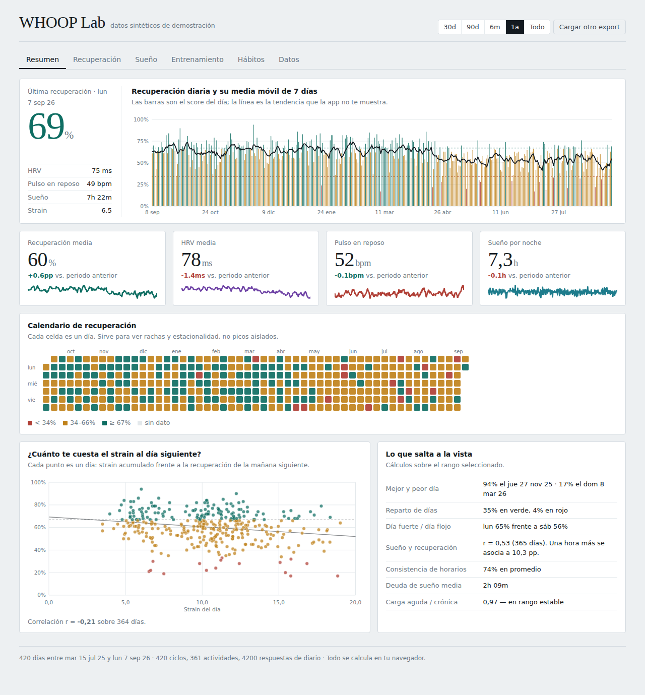

<div align="center">

# WHOOP Lab

**Your WHOOP export, analysed properly. In your browser. Nothing uploaded, ever.**

[](https://github.com/USER/whoop-lab/actions/workflows/ci.yml)
[](LICENSE)
[](tsconfig.app.json)

[Live demo](https://USER.github.io/whoop-lab/) · [Léeme en español](README.es.md)



</div>

## Why

WHOOP gives you a score every morning and then hides the series behind a paywall
and a fixed set of views. The export has everything: recovery, HRV, resting heart
rate, strain, full sleep architecture and every journal answer you have ever given.

WHOOP Lab reads that export and shows you the things the app will not:

- **Rolling baselines.** A 7-day recovery trend and a 28-day HRV baseline with a
  z-score, because a single day's HRV means nothing without your own distribution.
- **Strain today against recovery tomorrow.** A scatter with the fitted line and
  the correlation, so you can see what a hard session actually costs you.
- **Habit effects.** For every journal question, the difference in recovery
  between the days you answered yes and the days you answered no, with sample
  sizes and a Welch t statistic. This is the analysis that makes the export worth
  requesting.
- **Acute-to-chronic workload ratio.** 7-day strain over 28-day strain, the
  standard overreaching guardrail.
- **A joined daily table** you can copy straight into Excel, R or Stata.

## Privacy

Everything runs client-side. The CSVs are parsed in the browser, cached in
IndexedDB on your own machine, and never sent anywhere. There is no backend, no
analytics and no network request after the page loads. You can verify that in
about ten minutes of reading `src/lib/whoop/`.

`.gitignore` also blocks `*.csv` so you cannot accidentally commit your own
health data while hacking on this.

## Getting your data

In the WHOOP app: **More → App Settings → Data Export** (on Android, **More →
Data Export**). You get an email with a ZIP containing four files:

| File                       | What it holds                                                          |
| -------------------------- | ---------------------------------------------------------------------- |
| `physiological_cycles.csv` | One row per cycle: recovery, HRV, RHR, strain, calories, sleep summary |
| `sleeps.csv`               | Every sleep and nap, with stage breakdown                              |
| `workouts.csv`             | Classic activities. **Strength Trainer sessions are not included**     |
| `journal_entries.csv`      | Every journal answer you have ever given                               |

Limits worth knowing: one export per 24 hours, and as of early 2026 the export
excludes recovery activities, daily stress, steps and VO2 Max. See
[docs/formato-export-whoop.md](docs/formato-export-whoop.md) for the full column
reference and the parsing decisions that follow from it.

## Running it

```bash
git clone https://github.com/USER/whoop-lab.git
cd whoop-lab
npm install
npm run dev
```

Then drop your ZIP on the page, or click **mira una demo con datos sintéticos**
to explore with generated data that has real relationships baked into it.

```bash
npm run build      # typecheck + production bundle
npm test           # unit tests for the parser and the statistics
npm run lint       # eslint
npm run format     # prettier
```

## Stack and why

| Choice                                           | Reason                                                                                                                                              |
| ------------------------------------------------ | --------------------------------------------------------------------------------------------------------------------------------------------------- |
| React 19 + TypeScript (strict) + Vite            | Boring, fast, and the type system is doing real work in `src/lib/whoop/types.ts`                                                                    |
| Hand-built SVG charts on `d3-scale` / `d3-shape` | A charting library would have to be fought to keep this look. d3 supplies the maths; the components own the pixels                                  |
| Plain CSS with custom properties                 | The whole palette lives in `src/styles/tokens.css`. Charts resolve colours from the same tokens, so light and dark stay in sync with no duplication |
| Zustand                                          | One small store, no ceremony                                                                                                                        |
| IndexedDB via `idb-keyval`                       | A multi-year journal is well past the localStorage budget                                                                                           |

## Project layout

```
src/
  lib/whoop/     column mapping, CSV parsing, the day-record model
  lib/           stats, formatting, derived metrics, demo data, storage
  charts/        TimeSeries, StackedBar, Scatter, HBar, CalendarHeatmap, Sparkline
  components/    Panel, KpiCard, Legend, Segmented, ImportView
  views/         one file per tab
  state/         zustand store and the range/window selector
```

Read [docs/arquitectura.md](docs/arquitectura.md) before your first change; the
one rule that matters is that **views never compute** — every metric is derived
once in `buildDayRecords` and read from there.

## Contributing

Issues and PRs welcome. [docs/roadmap.md](docs/roadmap.md) lists the indicators
that are specified but not yet built, which is the easiest place to start. See
[CONTRIBUTING.md](CONTRIBUTING.md).

## Disclaimer

This is a data-visualisation tool, not a medical device, and it is not affiliated
with or endorsed by WHOOP. Correlations shown here are observational. Nothing
here is medical advice.

## License

MIT © contributors
