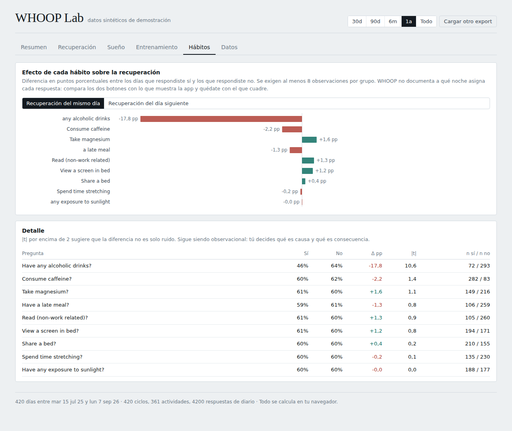
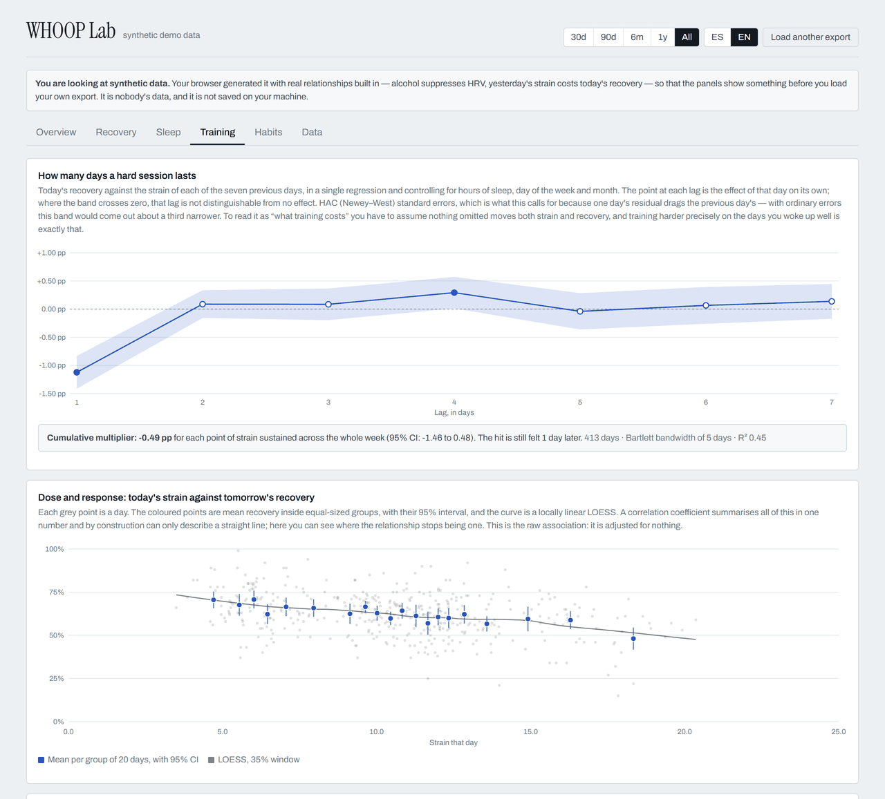
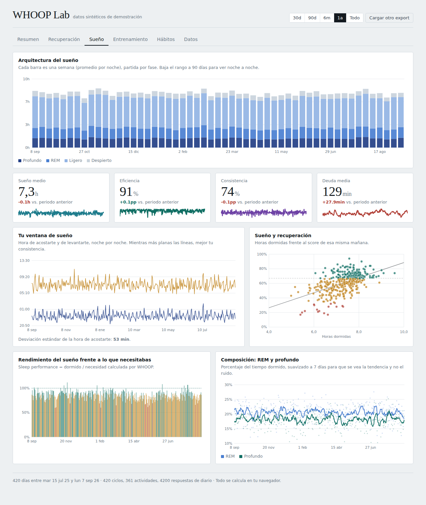
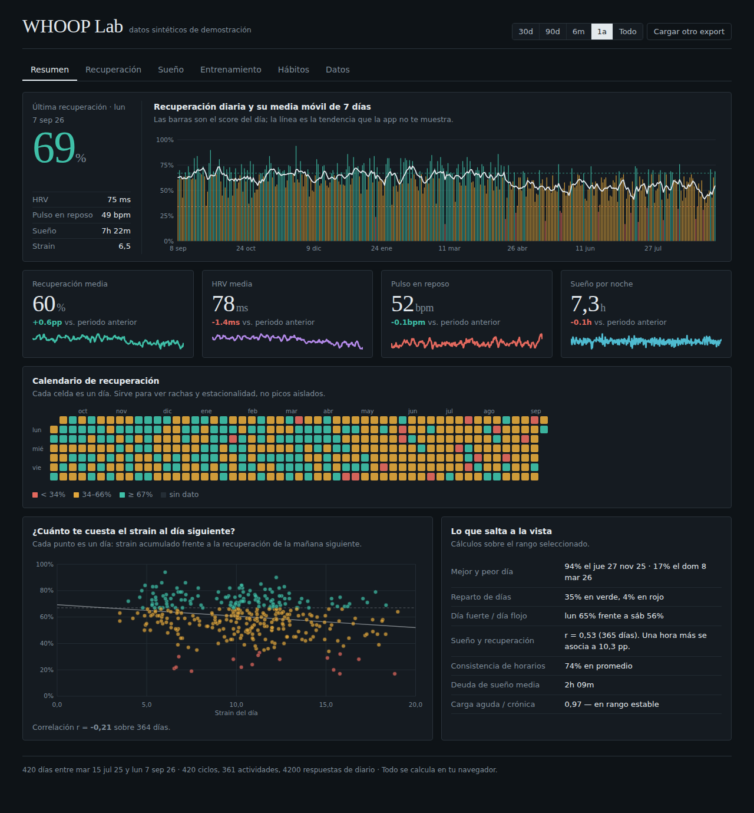
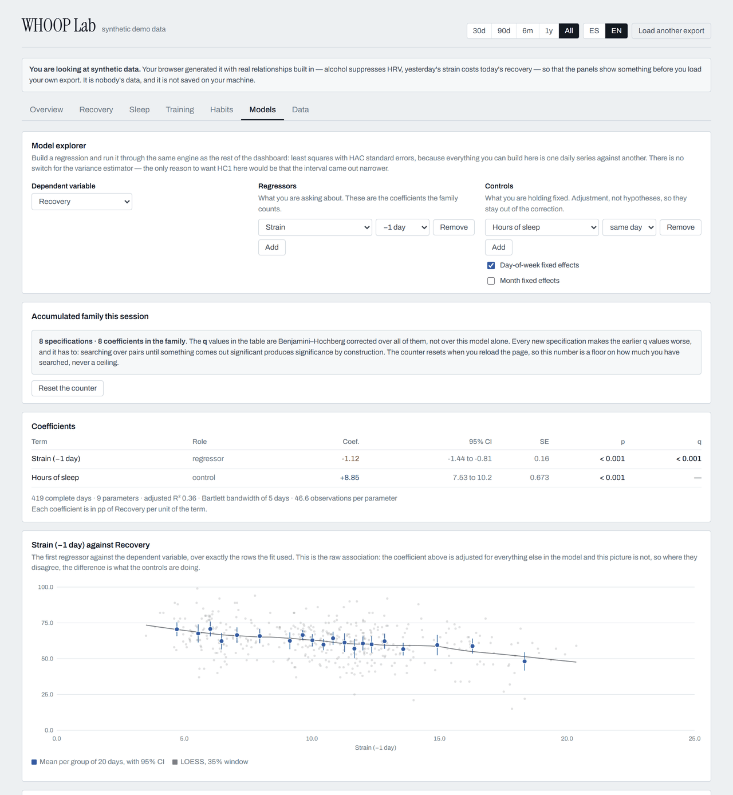
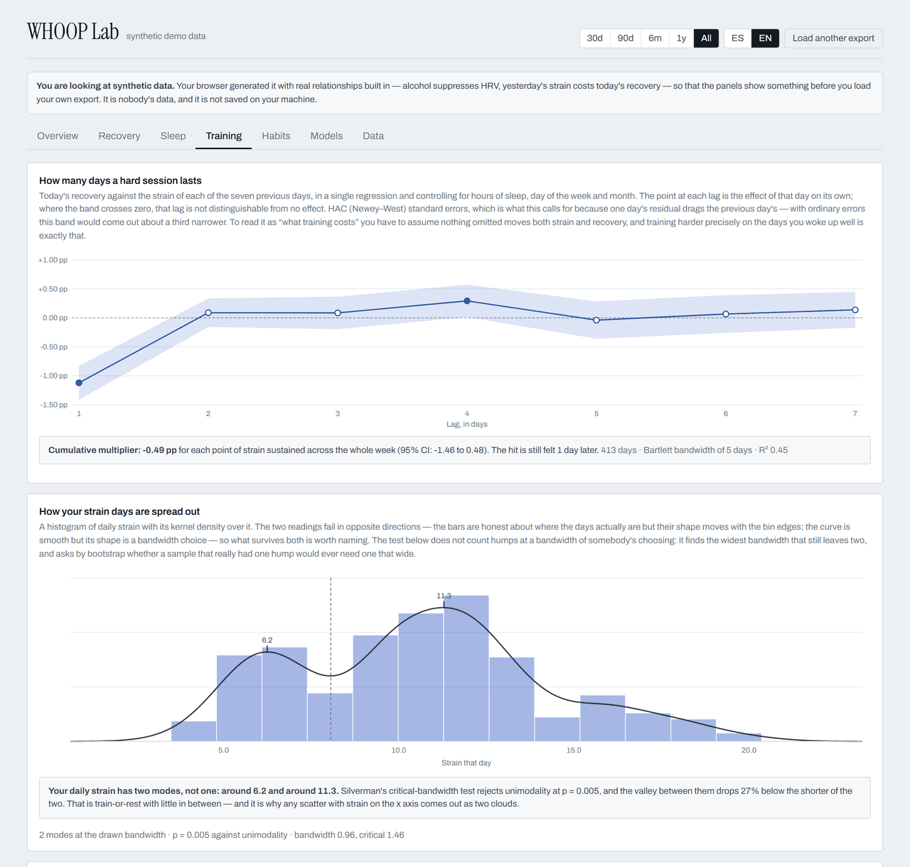

<div align="center">

# WHOOP Lab

**Your WHOOP export, analysed properly. In your browser. Nothing uploaded, ever.**

[](https://github.com/USER/whoop-lab/actions/workflows/ci.yml)
[](LICENSE)
[](tsconfig.app.json)

**[Open the live demo →](https://USER.github.io/whoop-lab/?demo=1)** · [Léeme en español](README.es.md)


</div>

## Why

WHOOP gives you a score every morning and then hides the series behind a paywall
and a fixed set of views. The export has everything: recovery, HRV, resting heart
rate, strain, full sleep architecture and every journal answer you have ever given.

Plenty of tools will draw that export back at you. These are the things none of
them do:

- **Habit effects from a regression, not a difference of means.** Every journal
  question enters one model at once, alongside hours of sleep, yesterday's strain,
  bedtime, and day-of-week and month fixed effects. It matters: alcohol arrives
  together with the weekend, with a late bedtime and with less sleep, and a
  difference of means credits the drink with the combined effect of all four. Both
  estimates are shown side by side so you can watch the gap.
- **An impulse response for strain.** Today's recovery against the strain of each
  of the previous seven days, in a single distributed-lag regression, with the
  cumulative multiplier and a confidence band. It answers "how many days does a
  hard session last" instead of "is strain correlated with recovery".
- **HAC (Newey–West) standard errors everywhere they belong.** One day's residual
  drags the previous day's, and ordinary errors on a daily series come out about a
  third too narrow — which is to say, a third too convincing.
- **Multiplicity control.** With a dozen journal questions tested at once, a false
  positive at p < 0.05 is the expected outcome, so coefficients are starred by
  Benjamini–Hochberg **q** and never by raw p.
- **Localised exports read natively.** A Spanish WHOOP account gets `sueño.csv`
  and `entrenamientos.csv` with every header translated. The parser matches
  accent-folded substrings of the header rather than exact names, so both come in
  without renaming anything.
- **A model explorer that counts how much you searched.** Build any regression
  out of the day record — dependent, regressors, controls, a lag per term — and it
  runs through the same HAC engine as everything else. The part no other tool has:
  it keeps the running family of every regressor you have tested this session and
  Benjamini–Hochberg corrects across all of them, so the q of your third model gets
  worse when you run your twentieth. Without that, a free-form explorer is a
  p-hacking machine — try enough pairs and something is significant by
  construction.
- **It tells you when the x axis has a hole in it.** Daily strain is usually
  bimodal — rest days in one hump, training days in another — and a Silverman
  critical-bandwidth test says so rather than leaving you to count humps at a
  bandwidth of your choosing. Wherever a chart's x support has an empty band, the
  panel says that the slope across it is joining two groups, not describing a
  relationship.
- **An interface in English and Spanish**, detected from your browser and
  switchable in the header. Number formats follow the language, so a decimal comma
  never turns up in an English page.

On top of the rolling baselines, the z-scores, the acute-to-chronic workload
ratio, a dose–response curve with a LOESS fit, a Lomb–Scargle periodogram that
tolerates the gaps in your export, and a joined daily table you can paste straight
into Excel, R or Stata.

Everything below is real synthetic data from the demo — 420 days generated in your
browser with real relationships baked in.

|                                                                |                                                            |
| -------------------------------------------------------------- | ---------------------------------------------------------- |
|  |           |
| **Habits.** The same questions estimated two ways.             | **Training.** How long a hard session actually lasts.      |
|                  |        |
| **Sleep.** Where extra hours stop buying recovery.             | **Dark mode**, following your system or your choice.       |
|                          |  |
| **Models.** Any regression you like, with the search counted.  | **Distribution.** Two modes, named and tested.             |

## Privacy

Everything runs client-side. The CSVs are parsed in the browser, cached in
IndexedDB on your own machine, and never sent anywhere. There is no backend, no
analytics and no network request after the page loads. You can verify that in
about ten minutes of reading `src/lib/whoop/`.

The demo at `?demo=1` generates its data on the spot and deliberately writes
nothing to IndexedDB, so following that link never touches an export you already
had cached.

`.gitignore` also blocks `*.csv` and the whole of `data/`, so you cannot
accidentally commit your own health data while hacking on this.

## Getting your data

In the WHOOP app: **More → App Settings → Data Export** (on Android, **More →
Data Export**). You get an email with a ZIP containing four files:

| File                       | What it holds                                                          |
| -------------------------- | ---------------------------------------------------------------------- |
| `physiological_cycles.csv` | One row per cycle: recovery, HRV, RHR, strain, calories, sleep summary |
| `sleeps.csv`               | Every sleep and nap, with stage breakdown                              |
| `workouts.csv`             | Classic activities. **Strength Trainer sessions are not included**     |
| `journal_entries.csv`      | Every journal answer you have ever given                               |

The export comes out in your account's language: a Spanish account gets
`sueño.csv` and `entrenamientos.csv` with every header translated. The parser
handles both, matching on accent-folded substrings of the header rather than on
exact names.

Limits worth knowing: one export per 24 hours, and as of early 2026 the export
excludes recovery activities, daily stress, steps and VO2 Max. See
[docs/formato-export-whoop.md](docs/formato-export-whoop.md) for the full column
reference and the parsing decisions that follow from it.

## Running it

```bash
git clone https://github.com/USER/whoop-lab.git
cd whoop-lab
npm install
npm run dev
```

Then drop your ZIP on the page, or open it with `?demo=1` — or click **try a demo
with synthetic data** — to explore with generated data that has real relationships
baked into it.

```bash
npm run build      # typecheck + production bundle
npm test           # unit tests for the parser and the statistics
npm run lint       # eslint
npm run format     # prettier
npm run fixture    # regenerate the anonymised test fixture from data/
```

### Working against your own export

Unzip your export into [`data/`](data/README.md) and `npm run dev` will start on
it, skipping the import screen — the header says _local data from data/_ so you
always know where the numbers came from. The folder is git-ignored, and two
independent guards keep it out of `npm run build`: the reader is imported only
behind `import.meta.env.DEV`, and a Vite plugin blanks the module during a build.
[docs/arquitectura.md](docs/arquitectura.md#desarrollo-con-datos-reales) has the
flow and the command to verify it.

`npm run fixture` turns that folder into the anonymised CSVs in
`src/test/fixtures/` — dates moved to a fictional year, noise on every
physiological value, journal questions cut to a neutral list. Those _are_
committed, and `src/test/fixture.test.ts` runs the whole pipeline over them.

## Stack and why

| Choice                                           | Reason                                                                                                                                                                         |
| ------------------------------------------------ | ------------------------------------------------------------------------------------------------------------------------------------------------------------------------------ |
| React 19 + TypeScript (strict) + Vite            | Boring, fast, and the type system is doing real work in `src/lib/whoop/types.ts`                                                                                               |
| Hand-written econometrics in `src/lib/econ/`     | QR least squares, HAC and HC1 covariance, distributed lags, LOESS, Lomb–Scargle, Silverman's modality test. No dependency does this in a form small enough to justify shipping |
| Hand-built SVG charts on `d3-scale` / `d3-shape` | A charting library would have to be fought to keep this look. d3 supplies the maths; the components own the pixels                                                             |
| Plain CSS with custom properties                 | The whole palette lives in `src/styles/tokens.css`. Charts resolve colours from the same tokens, so light and dark stay in sync with no duplication                            |
| Two typed message objects, no i18n library       | `Messages` is `typeof es`, so a key added in one language and missed in the other fails `npm run typecheck` rather than shipping                                               |
| Zustand                                          | One small store, no ceremony                                                                                                                                                   |
| IndexedDB via `idb-keyval`                       | A multi-year journal is well past the localStorage budget                                                                                                                      |

The initial download is **87 kB gzipped** (entry chunk plus CSS), of which React
is 61 kB. Every tab is a separate lazy chunk, so a first visit pays for the import
screen and nothing else, and the CSV parser — JSZip and PapaParse, 40 kB gzipped
between them — loads only once a file is actually dropped. See
[docs/arquitectura.md](docs/arquitectura.md#el-mapa-de-chunks) for the full map.

## Project layout

```
src/
  lib/whoop/     column mapping, CSV parsing, the day-record model
  lib/econ/      OLS with HAC/HC1, distributed lags, delta method, BH,
                 binscatter + LOESS, CUSUM + changepoints, Lomb–Scargle,
                 kernel density + Silverman modality + support gaps
  lib/explorer.ts, lib/fields.ts
                 the model explorer: field catalogue, specification grammar,
                 the accumulated multiple-testing family, saved presets
  lib/i18n/      the English and Spanish message catalogues, and the hook
  lib/           stats, formatting, derived metrics, demo data, storage
  charts/        TimeSeries, StackedBar, Scatter, BinScatter, Coefficient,
                 Irf, Spectrum, Histogram, HBar, CalendarHeatmap, Sparkline
  components/    Panel, KpiCard, Legend, Segmented, ImportView, ViewSkeleton
  views/         one file per tab, each its own lazy chunk
  state/         zustand store and the range/window selector
  test/          unit tests, plus the anonymised fixture in test/fixtures/
scripts/         maintainer tooling (make-fixture.ts)
data/            your own export, git-ignored, dev only
```

Read [docs/arquitectura.md](docs/arquitectura.md) before your first change; the
one rule that matters is that **views never compute** — every metric is derived
once in `buildDayRecords` and read from there.

## Contributing

Issues and PRs welcome. [docs/roadmap.md](docs/roadmap.md) lists the indicators
that are specified but not yet built, which is the easiest place to start. See
[CONTRIBUTING.md](CONTRIBUTING.md).

## Disclaimer

This is a data-visualisation tool, not a medical device, and it is not affiliated
with or endorsed by WHOOP. Everything it shows is observational: a coefficient
here is the association that remains after the controls in the model, which is
not the same thing as what would happen if you changed the habit. Nothing here is
medical advice.

## License

MIT © contributors
